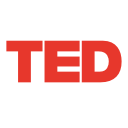

==========
TED player
==========

TED player is an app for Librarian_, Outernet's library management server.

TED player is written using HTML5 and JavaScript, and Librarian's experimental
files API to construct a playlist of TED_ videos and play them in the browser.

This app is still under development, and it serves as both a test case and
example of using Librarian for application development.

.. note::
    TED does not officially sponsor or endorse this app, nor does Outernet
    endorse TED. This app is just an example. All TED trademarks used in the
    app are copyrighted property of TED Conferences LLC.

.. _Librarian: https://github.com/Outernet-Project/librarian
.. _TED: http://www.ted.com/

